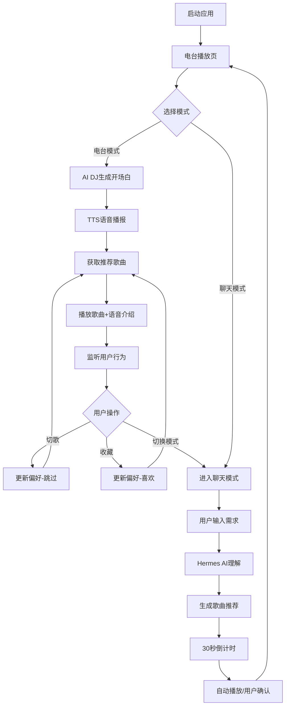

# Hermudio 产品需求文档

## 1. 产品概述

Hermudio 是一个AI个性化音乐电台应用，通过AI DJ自动播报开场白、歌曲介绍和过渡文案，支持电台模式（自动播放）和聊天模式（对话式点歌）。根据时间、天气、场景智能推荐音乐，为用户打造专属的沉浸式音乐体验。

目标：打造最懂用户的AI音乐伴侣，让每个人都能拥有专属的个性化电台。

## 2. 核心功能

### 2.1 用户角色

| 角色 | 注册方式 | 核心权限 |
|------|----------|----------|
| 普通用户 | 无需注册，直接使用 | 使用电台播放、聊天点歌、查看播放历史 |
| 网易云用户 | 网易云音乐账号扫码登录 | 访问个人歌单、每日推荐、完整播放功能 |

### 2.2 功能模块

本项目包含以下核心页面：

1. **电台播放页**: 核心播放界面、AI DJ语音播报、播放控制、可视化效果、场景感知推荐
2. **聊天模式页**: 对话式点歌、AI DJ智能问答、自然语言音乐推荐、30秒倒计时自动播放
3. **DJ全屏视图**: 沉浸式电台体验、音频可视化、实时DJ话术展示、完整播放控制

### 2.3 页面详情

| 页面名称 | 模块名称 | 功能描述 |
|----------|----------|----------|
| 电台播放页 | 播放信息区 | 显示当前歌曲名称、艺人、AI推荐原因说明 |
| 电台播放页 | 可视化效果 | 音频波形动画，播放时动态波动，暂停时静止 |
| 电台播放页 | 播放控制区 | 播放/暂停、上一首/下一首按钮，极简设计风格 |
| 电台播放页 | 模式切换 | 一键切换电台模式和聊天模式，音频完全隔离 |
| 电台播放页 | 状态栏 | 显示AI DJ在线状态、当前时间 |
| 聊天模式页 | 消息展示区 | 用户消息和AI回复的对话框形式，支持Markdown渲染 |
| 聊天模式页 | 输入区域 | 自然语言输入框，支持Enter发送，显示发送按钮 |
| 聊天模式页 | 正在输入指示器 | AI思考时显示动态打字指示器 |
| 聊天模式页 | 自动播放逻辑 | 推荐歌曲后30秒倒计时，用户可点击"播放这首"立即播放 |
| DJ全屏视图 | 流体渐变背景 | 动态渐变背景，营造沉浸式氛围 |
| DJ全屏视图 | 音频可视化画布 | 全屏Canvas绘制音频波形，64频段实时渲染 |
| DJ全屏视图 | DJ信息卡片 | 显示Hermes DJ头像、状态、实时天气信息 |
| DJ全屏视图 | DJ话术区 | 显示当前AI DJ播报的文字内容，支持说话状态动画 |
| DJ全屏视图 | 歌曲信息区 | 显示当前播放歌曲的封面占位、歌名、艺人 |
| DJ全屏视图 | 迷你播放器 | 进度条、播放控制、音量调节、播放模式切换 |

## 3. 核心流程

### 用户使用流程

1. 用户打开Hermudio，进入电台播放页
2. 可选择登录网易云音乐账号获取个性化推荐
3. 在电台模式下，AI DJ自动播放推荐歌曲并语音播报开场白和歌曲介绍
4. 用户可通过播放控制调整播放状态，或切换聊天模式进行对话式点歌
5. 系统持续学习用户反馈（跳过、收藏、完整播放），优化推荐

### AI DJ工作流程

1. 启动时获取当前时间、天气信息
2. 生成个性化开场白（根据时间段：早/中/晚/夜）
3. 使用TTS语音播报开场白
4. 根据用户画像和场景获取推荐歌曲
5. 播放歌曲前进行语音介绍
6. 监听用户行为（播放、跳过、收藏）
7. 根据反馈实时调整推荐策略

### 聊天模式流程

1. 用户输入自然语言描述想听的音乐或心情
2. Hermes AI理解用户意图并推荐歌曲
3. 显示推荐歌曲卡片，启动30秒倒计时
4. 用户可点击"播放这首"立即播放，或等待自动播放
5. 自动切换回电台模式播放推荐歌曲

## 4. 用户界面设计

### 4.1 设计风格

**整体风格定位**：极简深色主题音乐播放器，强调沉浸感和现代感

**颜色系统**：
- 主背景：`#0a0a0a`（近黑色）
- 次级背景：`#111111`（深灰）
- 主文字：`#ffffff`（纯白）
- 次级文字：`#888888`（中灰）
- 辅助文字：`#555555`（深灰）
- 强调色：`#ff6b6b`（珊瑚红）
- 在线状态：`#4ade80`（翠绿）
- 边框：`rgba(255,255,255,0.06)`（半透明白）

**字体规范**：
- 字体家族：-apple-system, BlinkMacSystemFont, 'Segoe UI', Roboto, sans-serif
- 应用Logo：18px / font-weight: 600 / letter-spacing: -0.5px
- 歌曲名称：24px / font-weight: 600 / letter-spacing: -0.3px
- 艺人名称：14px / font-weight: 400
- 界面文字：14px / font-weight: 400
- 辅助文字：11-13px / font-weight: 400

**按钮样式**：
- 播放按钮：64px圆形，2px白色边框，内部播放/暂停图标
- 控制按钮：透明背景，悬停opacity 0.7
- 发送按钮：40px圆形，白色背景，黑色箭头图标

**布局风格**：
- 移动端优先，最大宽度400px
- 垂直居中布局，高度100vh
- 圆角设计：输入框24px，气泡16px，按钮50%

**图标风格**：
- 使用Unicode符号（⏸ ▶ ⏮ ⏭ ➤）
- 头像使用Emoji（🎵 👤 🎙️）

### 4.2 页面设计概述

| 页面名称 | 模块名称 | UI元素描述 |
|----------|----------|------------|
| 电台播放页 | 顶部栏 | Logo左对齐，模式切换右对齐，含状态指示器 |
| 电台播放页 | 播放信息 | 歌曲名24px白色加粗居中，艺人名14px灰色居中 |
| 电台播放页 | 可视化 | 7个垂直条形，高度20%-80%，播放时波浪动画 |
| 电台播放页 | 推荐说明 | 13px灰色文字，最大宽度280px，多行居中 |
| 电台播放页 | 控制区 | 上一首/播放/下一首水平排列，间距32px |
| 聊天模式页 | 消息列表 | 垂直滚动，AI消息左对齐，用户消息右对齐 |
| 聊天模式页 | 头像 | 32px圆形，AI为珊瑚红背景，用户为深灰背景 |
| 聊天模式页 | 气泡 | 最大宽度260px，圆角16px，内边距12px 16px |
| 聊天模式页 | 输入区 | 底部固定，输入框圆角24px，发送按钮圆形 |
| DJ全屏视图 | 背景 | 4个渐变blob，模糊效果，缓慢漂浮动画 |
| DJ全屏视图 | 可视化 | Canvas全屏，64频段，渐变色彩，对称波形 |
| DJ全屏视图 | 顶部栏 | LIVE指示器（红点+文字），电台名称，时间，关闭按钮 |
| DJ全屏视图 | DJ卡片 | 白色毛玻璃效果，圆角24px，阴影 |
| DJ全屏视图 | DJ头像 | 64px圆形，🎙️Emoji，外圈旋转动画 |
| DJ全屏视图 | 迷你播放器 | 底部固定，进度条、控制按钮、音量条 |

### 4.3 动画与过渡效果

**播放动画**：
- 可视化条形：1s ease-in-out infinite波浪动画，不同相位延迟
- 暂停时：高度渐变到10%，动画停止

**微交互**：
- 按钮悬停：opacity 0.7过渡，200ms
- 输入框聚焦：边框颜色过渡到次级文字色
- 模式切换：指示器颜色渐变，300ms

**AI DJ动画**：
- 头像外圈：旋转动画，3s linear infinite
- 正在输入：三个圆点弹跳动画，1.4s infinite
- 气泡出现：平滑滚动到底部

### 4.4 响应式设计

**移动端优先设计**：
- 主设计基于400px宽度移动端
- 高度自适应，最大800px
- 全屏DJ视图适配各种屏幕尺寸

**适配策略**：
- 主应用容器：width 100%, max-width 400px
- Canvas可视化：动态resize适配窗口
- 字体使用相对单位

## 5. 非功能需求

### 5.1 性能要求
- 首屏加载时间 < 3秒
- 歌曲切换延迟 < 500ms
- AI响应时间 < 3秒
- TTS语音合成响应 < 2秒
- 播放过程中无卡顿

### 5.2 兼容性要求
- 支持Chrome、Firefox、Safari、Edge最新版本
- 支持macOS和Windows系统
- 移动端浏览器适配

### 5.3 安全要求
- 用户凭证加密存储（localStorage）
- API请求使用HTTPS（外部API）
- 敏感信息（API Key）存储在服务端环境变量

### 5.4 可用性要求
- 系统可用性 > 99%
- 支持离线播放已缓存歌曲
- 网络中断时优雅降级

## 6. 未来规划

### 6.1 短期规划（1-3个月）
- 支持更多音乐平台（QQ音乐、Spotify）
- 增加社交功能（分享歌曲、好友推荐）
- 优化AI推荐算法，提升准确率

### 6.2 中期规划（3-6个月）
- 移动端App开发
- 支持本地音乐文件导入
- 增加睡眠定时、闹钟功能

### 6.3 长期规划（6-12个月）
- 多房间音频同步播放
- AI作曲功能
- 虚拟演唱会体验
