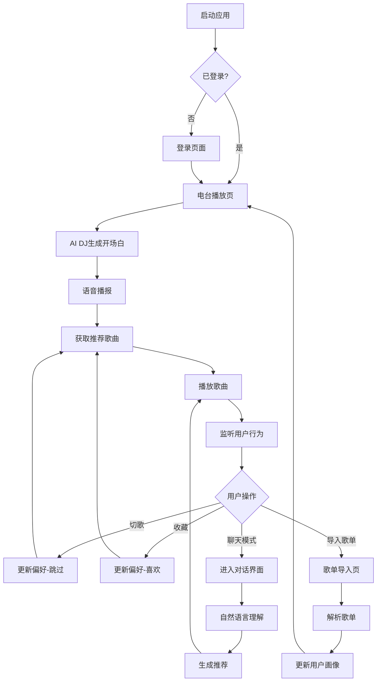

# Hermudio 产品需求文档

## 1. 产品概述

Hermudio 是一个AI个性化音乐电台，通过AI Agent自动学习用户音乐喜好，根据时间、天气、情绪、场景智能推荐音乐。支持电台模式（自动播放）和聊天模式（对话式点歌），为用户打造专属的沉浸式音乐体验。

目标：打造最懂用户的AI音乐伴侣，让每个人都能拥有专属的个性化电台。

## 2. 核心功能

### 2.1 用户角色

| 角色 | 注册方式 | 核心权限 |
|------|----------|----------|
| 普通用户 | 网易云音乐账号登录 | 使用电台播放、聊天点歌、导入歌单、查看播放历史 |
| VIP用户 | 订阅升级 | 高音质播放、无限跳过、专属AI音色、高级推荐算法 |

### 2.2 功能模块

本项目包含以下核心页面：

1. **电台播放页**: 核心播放界面、AI DJ语音播报、播放控制、歌曲信息展示
2. **聊天模式页**: 对话式点歌、自然语言音乐推荐、智能问答
3. **歌单导入页**: 多平台歌单导入、音乐偏好分析
4. **用户偏好页**: 音乐画像展示、偏好设置、播放历史
5. **设置页**: 账号管理、播放设置、AI音色选择

### 2.3 页面详情

| 页面名称 | 模块名称 | 功能描述 |
|----------|----------|----------|
| 电台播放页 | 播放器控制区 | 播放/暂停、上一首/下一首、音量调节、播放模式切换 |
| 电台播放页 | 歌曲信息展示 | 专辑封面、歌曲名称、艺人、专辑信息，支持封面旋转动画 |
| 电台播放页 | AI DJ播报 | 语音开场白、歌曲介绍、场景化话术，支持多种AI音色 |
| 电台播放页 | 播放列表 | 当前播放队列展示，支持拖拽排序、删除歌曲 |
| 电台播放页 | 场景感知 | 根据时间（早/中/晚/夜）、天气、心情自动调整推荐策略 |
| 聊天模式页 | 对话输入区 | 自然语言输入框，支持语音输入，发送按钮 |
| 聊天模式页 | 消息展示区 | 用户消息和AI回复的对话框形式展示，支持Markdown渲染 |
| 聊天模式页 | 快捷指令 | 预设快捷指令按钮："来首轻快的"、"适合工作的音乐"等 |
| 聊天模式页 | 推荐结果 | AI推荐歌曲卡片，支持一键播放、收藏、不喜欢 |
| 歌单导入页 | 链接导入 | 支持网易云音乐歌单链接粘贴解析 |
| 歌单导入页 | 文本导入 | 支持批量歌曲文本粘贴，自动识别歌曲名和艺人 |
| 歌单导入页 | 导入预览 | 展示解析后的歌曲列表，支持编辑、删除、确认导入 |
| 歌单导入页 | 偏好分析 | 导入后自动生成音乐偏好分析报告 |
| 用户偏好页 | 音乐画像 | 展示Top艺人、风格分布、年代偏好、播放习惯可视化 |
| 用户偏好页 | 播放历史 | 最近播放记录，支持按时间筛选、重新播放 |
| 用户偏好页 | 喜欢列表 | 用户收藏的歌曲列表，支持批量管理 |
| 设置页 | 账号管理 | 网易云音乐账号绑定/解绑、登录状态管理 |
| 设置页 | AI音色设置 | 选择DJ语音音色（男声/女声/特色音色）、语速调节 |
| 设置页 | 播放设置 | 音质选择、自动播放、淡入淡出效果 |

## 3. 核心流程

### 用户使用流程

1. 用户打开Claudio FM，进入电台播放页
2. 首次使用需登录网易云音乐账号
3. 可选择导入现有歌单或直接进入电台模式
4. 在电台模式下，AI DJ自动播放推荐歌曲并语音播报
5. 用户可通过播放控制调整播放状态，或切换聊天模式进行对话式点歌
6. 系统持续学习用户反馈（跳过、收藏、完整播放），优化推荐

### AI DJ工作流程

1. 启动时获取当前时间、天气信息
2. 生成个性化开场白并语音播报
3. 根据用户画像和场景获取推荐歌曲
4. 播放歌曲前进行语音介绍
5. 监听用户行为（播放、跳过、收藏）
6. 定时进行互动播报（每15-25分钟）
7. 根据反馈实时调整推荐策略

## 4. 用户界面设计

### 4.1 设计风格

**整体风格定位**：沉浸式深色主题音乐播放器，强调氛围感和音乐沉浸体验

**颜色系统**：
- 主色调：`#6366F1`（Indigo-500），用于播放按钮、进度条、激活状态
- 背景色：
  - 主背景：`#0F172A`（Slate-900）
  - 次级背景：`#1E293B`（Slate-800）
  - 卡片背景：`#334155`（Slate-700，透明度80%）
- 文字色：
  - 主文字：`#F8FAFC`（Slate-50）
  - 次级文字：`#94A3B8`（Slate-400）
  - 辅助文字：`#64748B`（Slate-500）
- 功能色：
  - 播放中：`#10B981`（Emerald-500）
  - 暂停：`#F59E0B`（Amber-500）
  - 错误：`#EF4444`（Red-500）
- 渐变效果：播放按钮使用 `linear-gradient(135deg, #6366F1 0%, #8B5CF6 100%)`

**字体规范**：
- 字体家族：Inter, -apple-system, BlinkMacSystemFont, "Segoe UI", sans-serif
- 字号层级：
  - 歌曲名称：24px / font-weight: 600
  - 艺人名称：16px / font-weight: 400
  - 界面文字：14px / font-weight: 400
  - 辅助文字：12px / font-weight: 400
- 行高：1.5

**按钮样式**：
- 播放按钮：圆形64px，渐变背景，悬停放大1.1倍
- 控制按钮：圆形40px，透明背景+白色图标
- 功能按钮：圆角8px，高度40px

**布局风格**：
- 居中布局，最大宽度800px
- 播放器区域垂直居中
- 底部固定控制栏

**图标风格**：
- 使用线性图标，线宽2px
- 图标尺寸：24px（控制）、20px（功能）

### 4.2 页面设计概述

| 页面名称 | 模块名称 | UI元素描述 |
|----------|----------|------------|
| 电台播放页 | 专辑封面区 | 居中显示，尺寸280x280px，圆角12px，播放时缓慢旋转 |
| 电台播放页 | 歌曲信息区 | 歌曲名24px白色加粗，艺人名16px灰色，居中对齐 |
| 电台播放页 | 进度条 | 紫色渐变，高度4px，圆角2px，支持拖拽 |
| 电台播放页 | 控制按钮区 | 播放/暂停居中64px，切歌40px，音量调节在右侧 |
| 电台播放页 | AI DJ气泡 | 底部浮动气泡，显示当前播报文字，支持点击展开历史 |
| 聊天模式页 | 消息列表 | 滚动区域，用户消息右对齐蓝色气泡，AI消息左对齐灰色气泡 |
| 聊天模式页 | 输入区域 | 底部固定，输入框圆角24px，发送按钮紫色渐变 |
| 聊天模式页 | 快捷指令栏 | 输入框上方横向滚动，标签式按钮 |
| 歌单导入页 | 输入区域 | 大文本框，支持粘贴链接或歌曲列表 |
| 歌单导入页 | 预览列表 | 歌曲卡片列表，显示序号、歌曲名、艺人、操作按钮 |
| 用户偏好页 | 画像卡片 | 圆形/环形图表展示风格分布、年代偏好 |
| 用户偏好页 | Top列表 | 横向滚动卡片展示Top艺人 |

### 4.3 响应式设计

**桌面优先设计**：
- 主设计基于1440px宽度桌面端
- 播放器区域始终居中显示

**适配断点**：
- 大屏幕（≥1440px）：完整布局，专辑封面280px
- 中屏幕（1024px-1439px）：专辑封面240px
- 平板（768px-1023px）：专辑封面200px，控制按钮缩小
- 不支持移动端（<768px）：提示使用桌面端访问

### 4.4 动画与过渡效果

**播放动画**：
- 专辑封面旋转：播放时360度旋转，20秒/圈，暂停时停止
- 进度条：平滑过渡，100ms更新
- 音量调节：滑动时实时反馈

**微交互**：
- 按钮悬停：放大1.05倍，持续时间200ms
- 卡片悬停：阴影加深，持续时间200ms
- 页面切换：淡入淡出，持续时间300ms

**AI DJ动画**：
- 语音波形：播放时显示动态波形
- 气泡弹出：从底部滑入，持续时间300ms

## 5. 非功能需求

### 5.1 性能要求
- 首屏加载时间 < 3秒
- 歌曲切换延迟 < 500ms
- AI语音合成响应 < 2秒
- 播放过程中无卡顿

### 5.2 兼容性要求
- 支持Chrome、Firefox、Safari、Edge最新版本
- 支持macOS和Windows系统

### 5.3 安全要求
- 用户凭证加密存储
- API请求使用HTTPS
- 敏感信息不存储在本地

### 5.4 可用性要求
- 系统可用性 > 99.5%
- 支持离线播放已缓存歌曲

## 6. 未来规划

### 6.1 短期规划（1-3个月）
- 支持更多音乐平台（QQ音乐、Spotify）
- 增加社交功能（分享歌曲、好友推荐）
- 优化AI推荐算法，提升准确率

### 6.2 中期规划（3-6个月）
- 移动端App开发
- 支持本地音乐文件导入
- 增加睡眠定时、闹钟功能

### 6.3 长期规划（6-12个月）
- 多房间音频同步播放
- AI作曲功能
- 虚拟演唱会体验
