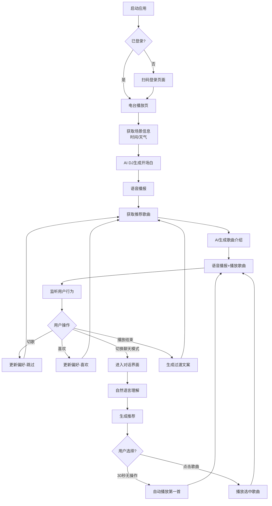

# Hermudio 产品需求文档

## 1. 产品概述

Hermudio 是一个AI个性化音乐电台，通过AI DJ自动播报开场白、歌曲介绍、过渡文案，支持语音播报。提供电台模式（自动播放）和聊天模式（对话式点歌），根据时间、天气、场景智能推荐音乐，为用户打造专属的沉浸式音乐体验。

目标：打造最懂用户的AI音乐伴侣，让每个人都能拥有专属的个性化电台。

## 2. 核心功能

### 2.1 用户角色

| 角色 | 注册方式 | 核心权限 |
|------|----------|----------|
| 普通用户 | 网易云音乐账号扫码登录 | 使用电台播放、聊天点歌、查看播放历史、提供音乐反馈 |
| 访客用户 | 无需登录 | 基础搜索、试听功能（受版权限制） |

### 2.2 功能模块

本项目包含以下核心页面：

1. **电台播放页**: AI DJ语音播报、实时歌词展示、播放控制、场景感知推荐
2. **聊天模式页**: 对话式点歌、自然语言音乐推荐、智能问答、30秒自动播放
3. **用户偏好页**: 音乐画像展示、播放历史、喜欢/跳过记录

### 2.3 页面详情

| 页面名称 | 模块名称 | 功能描述 |
|----------|----------|----------|
| 电台播放页 | AI DJ播报区 | 语音开场白、歌曲介绍、过渡文案，支持MiniMax TTS和浏览器语音合成 |
| 电台播放页 | 实时歌词展示 | 同步显示当前播报文案，支持逐字高亮 |
| 电台播放页 | 播放器控制区 | 播放/暂停、上一首/下一首、进度条、音量调节 |
| 电台播放页 | 歌曲信息展示 | 专辑封面、歌曲名称、艺人、专辑信息 |
| 电台播放页 | 场景感知推荐 | 根据时间（早/中/晚/夜）、天气自动调整推荐策略 |
| 电台播放页 | 每日播放记录 | 避免同一天重复推荐相同歌曲 |
| 聊天模式页 | 对话输入区 | 自然语言输入框，支持语音输入，发送按钮 |
| 聊天模式页 | 消息展示区 | 用户消息和AI回复的对话框形式展示 |
| 聊天模式页 | 推荐歌曲卡片 | AI推荐歌曲卡片，支持一键播放、30秒倒计时自动播放 |
| 聊天模式页 | 快捷指令 | 预设快捷指令："来首轻快的"、"推荐3首歌"、"播放爵士"等 |
| 用户偏好页 | 音乐画像 | 展示偏好风格、喜欢艺人、播放习惯 |
| 用户偏好页 | 播放历史 | 最近播放记录，支持重新播放 |
| 用户偏好页 | 反馈记录 | 喜欢/跳过记录，用于优化推荐 |

## 3. 核心流程

### 用户使用流程

1. 用户打开Hermudio，进入电台播放页
2. 首次使用需登录网易云音乐账号（扫码登录）
3. AI DJ根据当前时间、天气生成个性化开场白并语音播报
4. 系统根据场景和用户画像获取推荐歌曲
5. 播放歌曲前进行AI语音介绍
6. 用户可通过播放控制调整播放状态，或切换聊天模式进行对话式点歌
7. 系统持续学习用户反馈（跳过、收藏、完整播放），优化推荐

### 双模式切换流程

1. 电台模式：AI自动播报、自动推荐、连续播放
2. 聊天模式：对话式交互、用户主动点歌、30秒自动播放推荐
3. 模式切换时音频完全隔离，互不干扰

## 4. 用户界面设计

### 4.1 设计风格

**整体风格定位**：沉浸式深色主题音乐播放器，强调氛围感和音乐沉浸体验

**颜色系统**：
- 主色调：`#4ade80`（Emerald-400），用于播放按钮、激活状态
- 次色调：`#60a5fa`（Blue-400），用于辅助元素
- 背景色：
  - 主背景：`#0a0a0f`（深黑）
  - 次级背景：`#12121a`（深蓝黑）
  - 卡片背景：`#1a1a25`（带透明度的卡片）
- 文字色：
  - 主文字：`#ffffff`（白色）
  - 次级文字：`#a0a0b0`（灰白）
  - 辅助文字：`#606070`（深灰）
- 边框色：`rgba(255,255,255,0.08)`
- 渐变效果：进度条使用 `linear-gradient(90deg, #4ade80 0%, #22d3ee 100%)`

**字体规范**：
- 字体家族：-apple-system, BlinkMacSystemFont, 'Segoe UI', Roboto, sans-serif
- 字号层级：
  - 歌曲名称：18px / font-weight: 600
  - 艺人名称：13px / font-weight: 400
  - 界面文字：14px / font-weight: 400
  - 辅助文字：11px / font-weight: 400
- 行高：1.5

**按钮样式**：
- 播放按钮：圆形36px，白色背景，深色图标
- 控制按钮：圆形36px，透明背景+白色/彩色图标
- 模式切换按钮：圆角20px，胶囊式切换

**布局风格**：
- 移动优先设计，最大宽度480px
- 播放器区域垂直居中
- 底部固定控制栏

**图标风格**：
- 使用线性图标，简洁现代
- 图标尺寸：24px（控制）、20px（功能）

### 4.2 页面设计概述

| 页面名称 | 模块名称 | UI元素描述 |
|----------|----------|------------|
| 电台播放页 | 头部区域 | Logo（渐变头像+Hermes文字）、登录按钮、模式切换胶囊按钮 |
| 电台播放页 | 歌曲信息区 | 歌曲名18px白色加粗，艺人名13px灰色，居中对齐 |
| 电台播放页 | 进度条 | 绿色到青色渐变，高度4px，圆角2px，支持拖拽 |
| 电台播放页 | 控制按钮区 | 播放/暂停居中36px白色圆形，上一首/下一首36px透明边框圆形 |
| 电台播放页 | AI DJ播报区 | 滚动字幕区域，显示当前播报文字，支持逐字高亮 |
| 电台播放页 | 播放列表 | 底部弹出式播放队列，显示 upcoming 歌曲 |
| 聊天模式页 | 消息列表 | 滚动区域，用户消息右对齐，AI消息左对齐，带头像区分 |
| 聊天模式页 | 推荐卡片 | 横向滑动卡片，显示歌曲封面、歌名、艺人、倒计时进度条 |
| 聊天模式页 | 输入区域 | 底部固定，输入框圆角24px，发送按钮绿色渐变 |
| 聊天模式页 | 快捷指令栏 | 横向滚动标签按钮，快速选择常用指令 |

### 4.3 响应式设计

**移动优先设计**：
- 主设计基于移动端（375px-480px宽度）
- 适配iOS Safari底部安全区域
- 支持PWA添加到主屏幕

**适配断点**：
- 小屏幕（<375px）：紧凑布局，字体微调
- 标准移动（375px-480px）：完整布局
- 大屏幕（>480px）：居中显示，最大宽度限制

**特殊处理**：
- 不支持桌面端（<768px提示使用移动端）
- 支持深色模式（默认深色）
- 支持系统字体大小适配

### 4.4 动画与过渡效果

**播放动画**：
- 专辑封面：播放时轻微缩放脉冲效果
- 进度条：平滑过渡，100ms更新
- 音量调节：滑动时实时反馈

**微交互**：
- 按钮悬停：放大1.05倍，持续时间200ms
- 卡片悬停：阴影加深，持续时间200ms
- 页面切换：淡入淡出，持续时间300ms

**AI DJ动画**：
- 语音波形：播放时显示动态波形
- 文字高亮：逐字高亮同步语音播报
- 打字机效果：AI回复时的文字逐字显示

## 5. 非功能需求

### 5.1 性能要求
- 首屏加载时间 < 3秒
- 歌曲切换延迟 < 500ms
- AI语音合成响应 < 2秒
- 播放过程中无卡顿

### 5.2 兼容性要求
- 支持Chrome、Safari、Firefox最新版本
- 支持iOS Safari（iOS 14+）
- 支持Android Chrome（Android 10+）

### 5.3 安全要求
- 用户凭证通过ncm-cli安全存储
- API请求使用HTTPS
- 敏感信息不暴露在前端

### 5.4 可用性要求
- 系统可用性 > 99%
- 支持离线查看已加载内容
- 网络恢复后自动重连

## 6. 未来规划

### 6.1 短期规划（1-3个月）
- 支持更多音乐平台（QQ音乐、Spotify）
- 增加社交功能（分享歌曲、好友推荐）
- 优化AI推荐算法，提升准确率

### 6.2 中期规划（3-6个月）
- 支持本地音乐文件导入
- 增加睡眠定时、闹钟功能
- 多语言支持

### 6.3 长期规划（6-12个月）
- AI作曲功能
- 虚拟演唱会体验
- 跨设备同步播放
