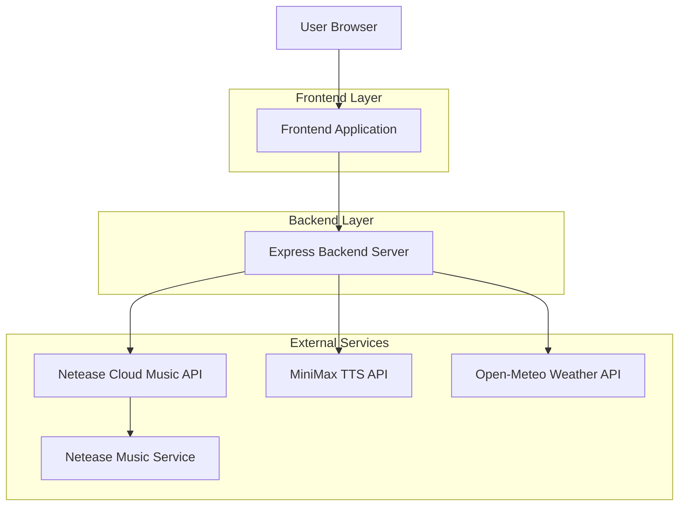
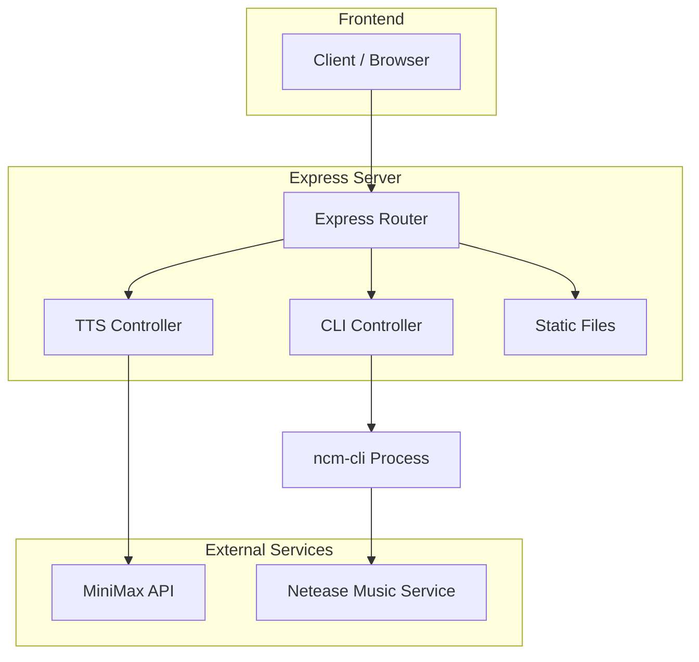

# Hermudio 技术架构文档

## 1. 架构设计



## 2. 技术描述

- **Frontend**: Vanilla JavaScript + HTML5 + CSS3
- **Backend**: Node.js@20 + Express@4
- **Music Source**: Netease Cloud Music CLI (@music163/ncm-cli)
- **TTS Service**: MiniMax TTS API (speech-2.8-hd)
- **Weather API**: Open-Meteo (Free, no API key required)
- **Initialization Tool**: npm init

### 核心依赖

```json
{
  "dependencies": {
    "axios": "^1.8.4",
    "cors": "^2.8.6",
    "express": "^4.22.1",
    "node-fetch": "^3.3.2",
    "uuid": "^9.0.0",
    "ws": "^8.20.0"
  }
}
```

## 3. 路由定义

| Route | Purpose |
|-------|---------|
| / | 主页面，电台播放界面 |
| /chat | 聊天模式页面 |
| /import | 歌单导入页面 |
| /profile | 用户偏好页面 |
| /settings | 设置页面 |

## 4. API 定义

### 4.1 网易云音乐 CLI API

#### 登录相关
```
POST /api/cli/login
```

Response:
| Param Name | Param Type | Description |
|------------|------------|-------------|
| success | boolean | 登录状态 |
| loginUrl | string | 扫码登录链接 |
| message | string | 提示信息 |

```
GET /api/cli/login/check
```

Response:
| Param Name | Param Type | Description |
|------------|------------|-------------|
| isLoggedIn | boolean | 是否已登录 |
| output | string | CLI原始输出 |

#### 歌曲搜索与播放
```
GET /api/cli/search?keyword={keyword}&limit={limit}
```

Response:
| Param Name | Param Type | Description |
|------------|------------|-------------|
| data | Song[] | 歌曲列表 |
| success | boolean | 请求状态 |

```
POST /api/cli/play
```

Request:
| Param Name | Param Type | isRequired | Description |
|------------|------------|------------|-------------|
| songId | string | true | 歌曲加密ID |
| originalId | number | false | 歌曲原始ID |
| songName | string | false | 歌曲名称 |
| artist | string | false | 艺人名称 |

```
POST /api/cli/pause
POST /api/cli/resume
POST /api/cli/next
POST /api/cli/prev
POST /api/cli/stop
```

#### 播放状态
```
GET /api/cli/status
```

Response:
| Param Name | Param Type | Description |
|------------|------------|-------------|
| isPlaying | boolean | 播放状态 |
| currentSong | Song | 当前歌曲 |
| volume | number | 音量 |
| playMode | string | 播放模式 |

```
GET /api/cli/playlist
```

Response:
| Param Name | Param Type | Description |
|------------|------------|-------------|
| data | Song[] | 播放列表 |
| currentIndex | number | 当前索引 |

#### 推荐歌曲
```
GET /api/cli/recommend/songs
```

Response:
| Param Name | Param Type | Description |
|------------|------------|-------------|
| data | Song[] | 推荐歌曲列表 |
| message | string | 提示信息 |

### 4.2 TTS API

#### 获取音色列表
```
GET /api/tts/voices
```

Response:
| Param Name | Param Type | Description |
|------------|------------|-------------|
| data | VoiceCategories | 分类音色列表 |

#### 语音合成
```
POST /api/tts/doubao
```

Request:
| Param Name | Param Type | isRequired | Description |
|------------|------------|------------|-------------|
| text | string | true | 要合成的文本 |
| voice_type | string | false | 音色类型 |
| speed | number | false | 语速 |
| vol | number | false | 音量 |
| pitch | number | false | 音调 |

Response:
| Param Name | Param Type | Description |
|------------|------------|-------------|
| data.audio | string | Base64编码的音频 |
| data.format | string | 音频格式 |

### 4.3 TypeScript 类型定义

```typescript
// 歌曲类型
interface Song {
  id: string;
  originalId: number;
  name: string;
  artist: string;
  album: string;
  duration: number;
  canPlay: boolean;
  coverImgUrl?: string;
}

// 用户偏好类型
interface UserPreferences {
  favoriteArtists: Map<string, number>;
  favoriteGenres: Map<string, number>;
  favoriteEras: Map<string, number>;
  likedSongs: Set<string>;
  skippedSongs: Set<string>;
  playHistory: PlayRecord[];
  importedPlaylists: Playlist[];
}

interface PlayRecord {
  song: string;
  artist: string;
  timestamp: number;
}

interface Playlist {
  id: string;
  name: string;
  songCount: number;
  importTime: number;
}

// AI DJ 状态
interface DJState {
  weather: string | null;
  temperature: number | null;
  timeOfDay: 'morning' | 'afternoon' | 'evening' | 'night';
  mood: string | null;
  consecutiveSkips: number;
  userPreferences: UserPreferences;
}

// TTS 配置
interface TTSConfig {
  enabled: boolean;
  currentVoice: string;
  speed: number;
  vol: number;
  pitch: number;
  availableVoices: {
    male: VoiceOption[];
    female: VoiceOption[];
  };
}

interface VoiceOption {
  id: string;
  name: string;
  desc: string;
  tags: string[];
}
```

## 5. 服务器架构图



## 6. 数据模型

### 6.1 本地存储数据结构

由于本项目使用本地存储（localStorage）保存用户数据，无后端数据库。

```typescript
// localStorage Keys
const STORAGE_KEYS = {
  USER_PREFERENCES: 'claudio_user_preferences',
  USER_PROFILE: 'claudio_user_profile',
  PLAYLIST_IMPORTER: 'claudio_playlist_importer',
  SETTINGS: 'claudio_settings'
};

// 用户偏好存储结构
interface StoredPreferences {
  favoriteArtists: [string, number][];
  favoriteGenres: [string, number][];
  favoriteEras: [string, number][];
  likedSongs: string[];
  skippedSongs: string[];
  playHistory: PlayRecord[];
  importedPlaylists: Playlist[];
}
```

### 6.2 核心类设计

#### DJController
```javascript
class DJController {
  mode: 'music' | 'dj';
  isPlaying: boolean;
  currentTrack: Song | null;
  playlist: Song[];
  currentIndex: number;
  playHistory: PlayRecord[];
  djState: DJState;
  ttsConfig: TTSConfig;
  
  // 核心方法
  async startDJMode(): Promise<DJResult>;
  stopDJMode(): void;
  async speak(text: string): Promise<TTSResult>;
  async playSong(song: Song): Promise<PlayResult>;
  recordPlayBehavior(song: Song, behavior: string): void;
  calculatePreferenceScore(song: Song): number;
}
```

#### PlaylistImporter
```javascript
class PlaylistImporter {
  userProfile: UserProfile;
  recommendConfig: RecommendConfig;
  
  // 核心方法
  async importNeteasePlaylist(url: string): Promise<ImportResult>;
  async importFromText(text: string): Promise<ImportResult>;
  async getPersonalizedRecommendations(options: RecommendOptions): Promise<RecommendResult>;
  updateProfileFromSongs(songs: Song[], source: string): void;
  recordPlayBehavior(song: Song, behavior: string): void;
}
```

## 7. 组件清单

### 7.1 前端组件

| 组件名 | 用途 | 文件位置 |
|--------|------|----------|
| Player | 播放器主组件 | dj-view.js |
| DJController | DJ逻辑控制器 | dj-controller.js |
| PlaylistImporter | 歌单导入器 | playlist-importer.js |
| ChatInterface | 聊天界面 | app.js (chat page) |

### 7.2 后端模块

| 模块名 | 用途 | 文件位置 |
|--------|------|----------|
| Server | Express服务器主入口 | server.js |
| CLI API | 网易云CLI接口封装 | server.js (CLI routes) |
| TTS API | 语音合成接口 | server.js (TTS routes) |
| Hermes Bridge | 桥接服务 | hermes-bridge.js |

## 8. 项目结构

```
claudio-fm/
├── server.js                 # Express服务器主文件
├── dj-controller.js          # AI DJ控制器
├── playlist-importer.js      # 歌单导入与推荐系统
├── hermes-bridge.js          # 桥接服务
├── dj-view.js               # DJ视图组件
├── mvp-dashboard/           # 前端界面
│   └── app.js               # 主应用逻辑
├── .ncm-home/               # 网易云CLI配置目录
│   └── .config/ncm-cli/
├── package.json             # 项目依赖
└── .trae/documents/         # 文档目录
    ├── claudio-fm-prd.md    # PRD文档
    └── claudio-fm-tech-spec.md  # 技术文档
```

## 9. 开发规范

### 9.1 代码组织

- 前端代码：原生JavaScript，无框架依赖
- 后端代码：Express路由模块化组织
- 配置文件：环境变量管理敏感信息

### 9.2 命名规范

- 变量/函数：camelCase
- 类名：PascalCase
- 常量：UPPER_SNAKE_CASE
- 文件：kebab-case

### 9.3 API设计规范

- RESTful API设计
- 统一返回格式：{ success: boolean, data?: any, message?: string, error?: string }
- 错误处理：HTTP状态码 + 错误信息

## 10. 部署说明

### 10.1 环境要求

- Node.js >= 18.0.0
- npm >= 9.0.0
- macOS / Linux / Windows

### 10.2 启动步骤

```bash
# 安装依赖
npm install

# 启动服务器
npm start

# 服务器运行在 http://localhost:6588
```

### 10.3 环境变量

```bash
# MiniMax TTS API配置（可选）
MINIMAX_API_KEY=your_api_key
MINIMAX_GROUP_ID=your_group_id
```

## 11. 第三方服务集成

### 11.1 网易云音乐 CLI

- 包名：@music163/ncm-cli
- 功能：音乐搜索、播放、歌单管理
- 配置：自动在项目目录下创建.ncm-home配置

### 11.2 MiniMax TTS

- API版本：speech-2.8-hd
- 功能：文本转语音
- 音色：支持多种男女声、特色音色

### 11.3 Open-Meteo Weather

- 免费天气API
- 无需API Key
- 支持全球位置天气查询
