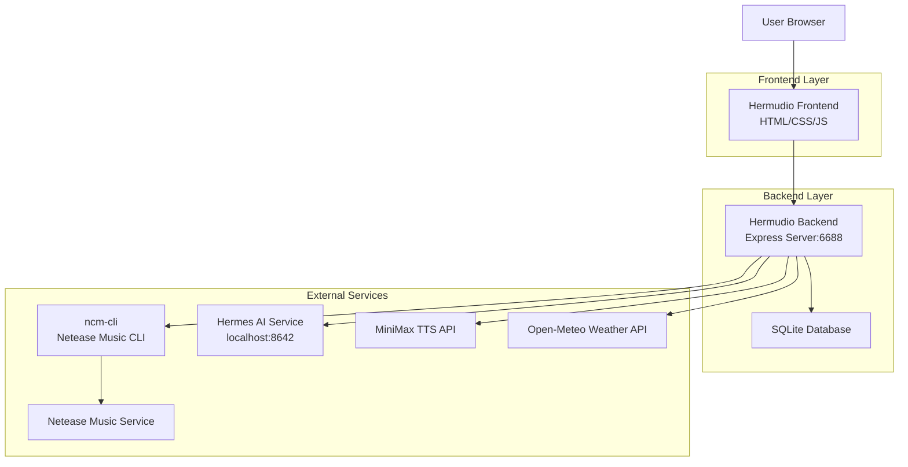
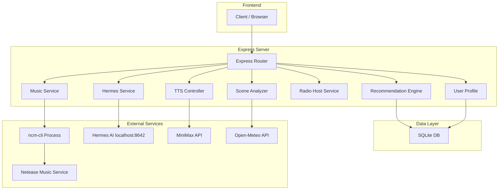
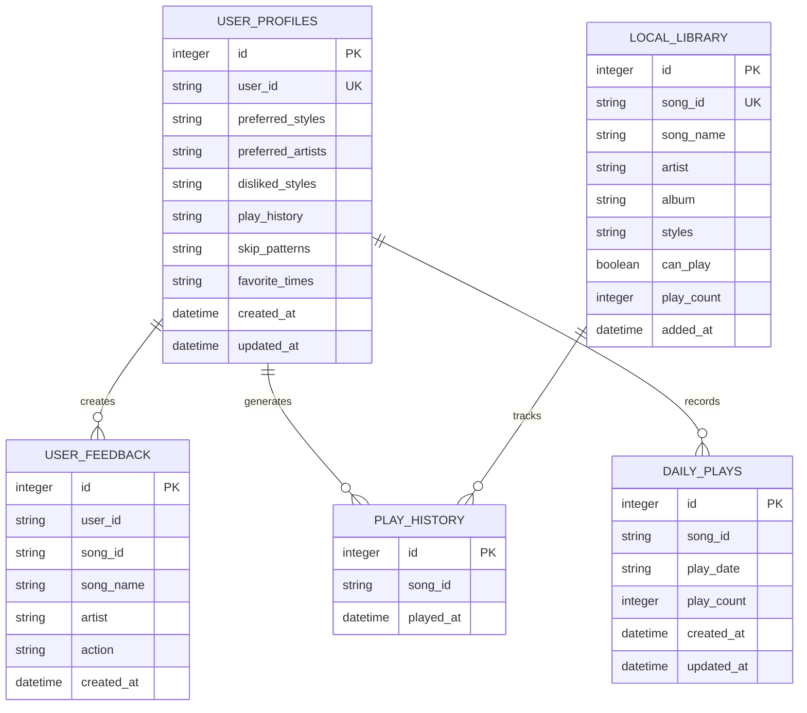

# Hermudio 技术架构文档

## 1. 架构设计



## 2. 技术描述

- **Frontend**: Vanilla JavaScript + HTML5 + CSS3 (Mobile-first)
- **Backend**: Node.js@20 + Express@4
- **Database**: SQLite3 (本地文件存储)
- **Music Source**: @music163/ncm-cli (网易云音乐CLI)
- **AI Service**: Hermes AI (本地LLM服务，端口8642)
- **TTS Service**: MiniMax TTS API (speech-2.8-hd) + Web Speech API (浏览器降级)
- **Weather API**: Open-Meteo (免费，无需API Key)
- **Initialization Tool**: npm init

### 核心依赖

```json
{
  "dependencies": {
    "axios": "^1.8.4",
    "cors": "^2.8.6",
    "express": "^4.22.1",
    "node-fetch": "^3.3.2",
    "sqlite3": "^5.1.6",
    "uuid": "^9.0.0",
    "ws": "^8.20.0"
  }
}
```

## 3. 路由定义

| Route | Purpose |
|-------|---------|
| / | 主页面，电台播放界面 |
| /chat | 聊天模式页面 |
| /profile | 用户偏好页面 |

### API 端点列表

| Method | Endpoint | Description |
|--------|----------|-------------|
| GET | /api/health | 健康检查 |
| GET | /api/scene | 获取当前场景（时间/天气） |
| GET | /api/search | 搜索歌曲 |
| GET | /api/recommend | 获取推荐歌曲 |
| POST | /api/play | 播放指定歌曲 |
| POST | /api/play-recommend | 播放推荐歌曲 |
| POST | /api/stop | 停止播放 |
| POST | /api/previous | 播放上一首 |
| GET | /api/status | 获取播放状态 |
| GET | /api/song/:songId | 获取歌曲详情 |
| GET | /api/profile | 获取用户画像 |
| POST | /api/profile | 更新用户画像 |
| POST | /api/feedback | 记录喜欢/跳过反馈 |
| GET | /api/stats | 获取用户统计 |
| GET | /api/history | 获取播放历史 |
| POST | /api/chat | Hermes AI聊天 |
| GET | /api/chat/history | 获取聊天历史 |
| POST | /api/chat/clear | 清空聊天历史 |
| GET | /api/chat/welcome | 获取聊天欢迎语 |
| GET | /api/radio/welcome | 生成电台欢迎语 |
| POST | /api/radio/song-intro | 生成歌曲介绍 |
| POST | /api/radio/song-outro | 生成歌曲结束语 |
| GET | /api/radio/playlist | 获取今日歌单 |
| POST | /api/radio/mark-played | 标记歌曲已播放 |
| POST | /api/auth/login | 开始网易云登录 |
| GET | /api/auth/status | 检查登录状态 |
| POST | /api/auth/logout | 退出登录 |
| GET | /api/tts/voices | 获取TTS音色列表 |
| POST | /api/tts/doubao | MiniMax语音合成 |

## 4. API 定义

### 4.1 核心类型定义

```typescript
// 歌曲类型
interface Song {
  id: string;              // 加密ID
  encryptedId: string;     // 加密ID（用于ncm-cli）
  originalId: number;      // 原始ID
  name: string;
  artist: string;
  album: string;
  duration: number;
  canPlay: boolean;
  vipFlag: boolean;
  coverImgUrl?: string;
}

// 场景类型
interface Scene {
  timeOfDay: 'morning' | 'afternoon' | 'evening' | 'night';
  weather: 'sunny' | 'cloudy' | 'rainy' | 'snowy';
  mood: 'energetic' | 'happy' | 'relaxed' | 'focused' | 'melancholy' | 'peaceful';
  hour: number;
  timestamp: string;
}

// 用户画像类型
interface UserPreferences {
  userId: string;
  preferredStyles: string[];
  preferredArtists: string[];
  dislikedStyles: string[];
  playHistory: PlayRecord[];
  skipPatterns: Record<string, number>;
  favoriteTimes: Record<string, number>;
  createdAt: string;
  updatedAt: string;
}

interface PlayRecord {
  songId: string;
  timestamp: string;
  completed: boolean;
}

// 推荐结果类型
interface Recommendation {
  song: Song;
  reason: string;
  source: 'search' | 'library' | 'scene' | 'popular' | 'default' | 'style_match';
  searchQuery?: string;
}

// AI聊天响应类型
interface ChatResponse {
  message: string;
  action: 'play' | 'recommend' | 'pause' | 'skip' | 'feedback' | 'greeting' | 'chat' | 'info' | 'none';
  song?: Song;
  recommendedSongs?: Song[];
  autoPlayTimeout?: number;
  ai?: boolean;
}

// TTS配置类型
interface TTSConfig {
  voice_type: string;
  speed: number;
  vol: number;
  pitch: number;
}
```

### 4.2 关键API详情

#### 获取推荐歌曲
```
GET /api/recommend?userId={userId}
```

Response:
| Param Name | Param Type | Description |
|------------|------------|-------------|
| success | boolean | 请求状态 |
| recommendation | Recommendation | 推荐结果 |

#### AI聊天
```
POST /api/chat
```

Request:
| Param Name | Param Type | isRequired | Description |
|------------|------------|------------|-------------|
| message | string | true | 用户消息 |
| userId | string | false | 用户ID |

Response:
| Param Name | Param Type | Description |
|------------|------------|-------------|
| success | boolean | 请求状态 |
| message | string | AI回复 |
| action | string | 操作类型 |
| song | Song | 播放的歌曲（如有） |
| recommendedSongs | Song[] | 推荐歌曲列表（如有） |

#### 语音合成
```
POST /api/tts/doubao
```

Request:
| Param Name | Param Type | isRequired | Description |
|------------|------------|------------|-------------|
| text | string | true | 要合成的文本 |
| voice_type | string | false | 音色类型 |
| speed | number | false | 语速 |
| vol | number | false | 音量 |
| pitch | number | false | 音调 |

Response:
| Param Name | Param Type | Description |
|------------|------------|-------------|
| success | boolean | 请求状态 |
| data.audio | string | Base64编码的音频 |
| data.format | string | 音频格式(mp3) |

## 5. 服务器架构图



## 6. 数据模型

### 6.1 数据模型定义



### 6.2 数据定义语言

```sql
-- 用户画像表
CREATE TABLE IF NOT EXISTS user_profiles (
    id INTEGER PRIMARY KEY AUTOINCREMENT,
    user_id TEXT UNIQUE NOT NULL,
    preferred_styles TEXT DEFAULT '[]',
    preferred_artists TEXT DEFAULT '[]',
    disliked_styles TEXT DEFAULT '[]',
    play_history TEXT DEFAULT '[]',
    skip_patterns TEXT DEFAULT '{}',
    favorite_times TEXT DEFAULT '{}',
    created_at DATETIME DEFAULT CURRENT_TIMESTAMP,
    updated_at DATETIME DEFAULT CURRENT_TIMESTAMP
);

-- 播放历史表
CREATE TABLE IF NOT EXISTS play_history (
    id INTEGER PRIMARY KEY AUTOINCREMENT,
    song_id TEXT NOT NULL,
    played_at DATETIME DEFAULT CURRENT_TIMESTAMP
);

-- 本地音乐库表
CREATE TABLE IF NOT EXISTS local_library (
    id INTEGER PRIMARY KEY AUTOINCREMENT,
    song_id TEXT UNIQUE NOT NULL,
    song_name TEXT,
    artist TEXT,
    album TEXT,
    styles TEXT DEFAULT '[]',
    can_play BOOLEAN DEFAULT 1,
    play_count INTEGER DEFAULT 0,
    added_at DATETIME DEFAULT CURRENT_TIMESTAMP
);

-- 用户反馈表
CREATE TABLE IF NOT EXISTS user_feedback (
    id INTEGER PRIMARY KEY AUTOINCREMENT,
    user_id TEXT NOT NULL,
    song_id TEXT NOT NULL,
    song_name TEXT,
    artist TEXT,
    action TEXT,
    created_at DATETIME DEFAULT CURRENT_TIMESTAMP
);

-- 每日播放记录表（避免重复推荐）
CREATE TABLE IF NOT EXISTS daily_plays (
    id INTEGER PRIMARY KEY AUTOINCREMENT,
    song_id TEXT NOT NULL,
    play_date TEXT NOT NULL,
    play_count INTEGER DEFAULT 1,
    created_at DATETIME DEFAULT CURRENT_TIMESTAMP,
    updated_at DATETIME DEFAULT CURRENT_TIMESTAMP,
    UNIQUE(song_id, play_date)
);

-- 创建索引
CREATE INDEX IF NOT EXISTS idx_daily_plays_date ON daily_plays(play_date);
CREATE INDEX IF NOT EXISTS idx_play_history_played_at ON play_history(played_at);
CREATE INDEX IF NOT EXISTS idx_user_feedback_user_id ON user_feedback(user_id);
```

## 7. 项目结构

```
Hermudio/
├── server.js                    # 外层Express服务器（端口6588）
├── Hermudio/
│   ├── server.js               # 主服务器（端口6688）
│   ├── src/
│   │   ├── music-service.js    # 音乐服务（ncm-cli集成）
│   │   ├── recommendation-engine.js  # 推荐引擎
│   │   ├── scene-analyzer.js   # 场景分析器（时间/天气）
│   │   ├── hermes-service.js   # Hermes AI服务集成
│   │   ├── radio-host-service.js  # 电台主持人服务
│   │   ├── radio-host.js       # 电台主持人（旧版）
│   │   ├── tts-service.js      # TTS服务（浏览器端）
│   │   └── user-profile.js     # 用户画像服务
│   ├── public/
│   │   ├── index.html          # 主页面（电台+聊天双模式）
│   │   └── sw.js               # Service Worker
│   └── data/
│       └── hermudio.db         # SQLite数据库
├── .ncm-home/                  # ncm-cli配置目录
│   └── .config/ncm-cli/
├── package.json
└── .trae/documents/
    ├── hermudio-prd.md         # PRD文档
    └── hermudio-tech-spec.md   # 技术架构文档
```

## 8. 核心服务说明

### 8.1 MusicService
- 负责与ncm-cli交互，执行音乐搜索、播放、停止等操作
- 管理播放队列，支持上一首/下一首
- 维护播放历史记录

### 8.2 RecommendationEngine
- 基于场景（时间/天气/心情）的多策略推荐
- 用户偏好学习和匹配
- 每日播放记录去重
- 过滤用户不喜欢的风格（电子、嘻哈、白噪音等）

### 8.3 SceneAnalyzer
- 获取当前时间并推断时段（早晨/下午/傍晚/深夜）
- 调用Open-Meteo API获取天气信息
- 根据时间和天气推断用户心情

### 8.4 HermesService
- 与本地Hermes AI服务通信（端口8642）
- 处理用户聊天消息，解析意图
- 生成电台口播文案（开场白/歌曲介绍/过渡语）
- 支持多种对话场景（点歌、推荐、控制播放等）

### 8.5 RadioHostService
- 管理电台播报流程
- 调用Hermes AI生成高质量文案
- 提供兜底模板文案
- 控制文案长度（欢迎语<100字，过渡语<60字）

### 8.6 UserProfile
- 管理用户偏好数据
- 记录播放历史和反馈
- 学习用户喜好，优化推荐

## 9. 开发规范

### 9.1 代码组织
- 前端代码：原生JavaScript，无框架依赖
- 后端代码：Express路由模块化组织
- 服务代码：按功能模块化，每个服务独立文件

### 9.2 命名规范
- 变量/函数：camelCase
- 类名：PascalCase
- 常量：UPPER_SNAKE_CASE
- 文件：kebab-case

### 9.3 API设计规范
- RESTful API设计
- 统一返回格式：`{ success: boolean, data?: any, message?: string, error?: string }`
- 错误处理：HTTP状态码 + 错误信息

## 10. 部署说明

### 10.1 环境要求
- Node.js >= 18.0.0
- npm >= 9.0.0
- macOS / Linux / Windows
- Hermes AI服务（端口8642）

### 10.2 启动步骤
```bash
# 安装依赖
npm install

# 启动Hermudio服务器
node Hermudio/server.js

# 服务器运行在 http://localhost:6688
```

### 10.3 环境变量
```bash
# MiniMax TTS API配置（可选）
MINIMAX_API_KEY=your_api_key
MINIMAX_GROUP_ID=your_group_id

# 服务器端口（可选）
PORT=6688
```

## 11. 第三方服务集成

### 11.1 网易云音乐 CLI
- 包名：@music163/ncm-cli
- 功能：音乐搜索、播放、歌单管理
- 配置：自动在项目目录下.ncm-home创建配置

### 11.2 Hermes AI
- 本地部署的AI服务
- 端口：8642
- 功能：自然语言对话、文案生成
- 模型：hermes-agent

### 11.3 MiniMax TTS
- API版本：speech-2.8-hd
- 功能：文本转语音
- 音色：支持多种男女声、特色音色

### 11.4 Open-Meteo Weather
- 免费天气API
- 无需API Key
- 支持全球位置天气查询
