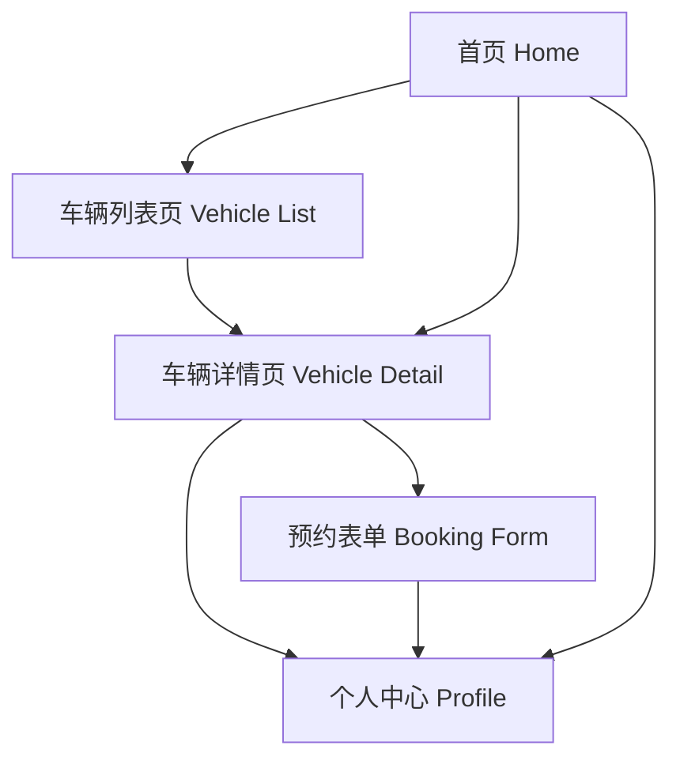

# 二手车智慧门店 - 产品需求文档 (Figma 设计风格版)

## 1. Product Overview

二手车智慧门店是一个现代化的二手车交易平台，采用简约大气的 Figma 设计风格，为买家提供便捷的车辆浏览、筛选和咨询服务。

目标用户：有购车需求的个人消费者，追求高效、透明的二手车交易体验。

## 2. Core Features

### 2.1 User Roles

| Role | Registration Method | Core Permissions |
|------|---------------------|------------------|
| 访客用户 | 无需注册 | 浏览车辆列表、查看车辆详情、使用筛选功能 |
| 注册用户 | 手机号/微信注册 | 收藏车辆、预约看车、在线咨询、查看浏览历史 |

### 2.2 Feature Module

二手车智慧门店包含以下主要页面：

1. **首页 (Home)**：Hero 区域、车辆分类入口、热门推荐、门店信息展示
2. **车辆列表页 (Vehicle List)**：高级筛选、车辆卡片列表、分页/无限滚动
3. **车辆详情页 (Vehicle Detail)**：车辆图片画廊、详细参数、价格信息、咨询预约
4. **个人中心 (Profile)**：用户信息、收藏列表、浏览历史、预约记录

### 2.3 Page Details

| Page Name | Module Name | Feature description |
|-----------|-------------|---------------------|
| 首页 | Hero Section | 展示品牌标语、搜索入口、背景视觉图，支持快速搜索车辆 |
| 首页 | 车辆分类 | 按品牌、价格区间、车型分类展示入口卡片 |
| 首页 | 热门推荐 | 展示精选热门车辆，支持横向滑动浏览 |
| 首页 | 门店信息 | 展示门店地址、营业时间、联系电话、地图位置 |
| 车辆列表页 | 筛选栏 | 支持按品牌、价格、车龄、里程、排量等多维度筛选 |
| 车辆列表页 | 排序功能 | 支持按价格、上架时间、里程数排序 |
| 车辆列表页 | 车辆卡片 | 展示车辆主图、品牌型号、价格、里程、上牌时间等关键信息 |
| 车辆详情页 | 图片画廊 | 支持多图轮播、全屏查看、缩放功能 |
| 车辆详情页 | 车辆信息 | 展示详细参数（发动机、变速箱、车身颜色、排放标准等） |
| 车辆详情页 | 价格信息 | 展示售价、新车指导价、节省金额、分期方案 |
| 车辆详情页 | 咨询预约 | 提供在线咨询、预约看车按钮，表单填写联系方式 |
| 个人中心 | 用户信息 | 展示用户头像、昵称、会员等级 |
| 个人中心 | 收藏列表 | 展示用户收藏的车辆，支持取消收藏 |
| 个人中心 | 浏览历史 | 展示最近浏览的车辆记录 |
| 个人中心 | 预约记录 | 展示看车预约状态（待确认、已确认、已完成） |

## 3. Core Process

### 用户浏览购车流程

1. 用户进入首页，浏览 Hero 区域和热门推荐
2. 通过搜索或分类入口进入车辆列表页
3. 使用筛选和排序功能缩小选择范围
4. 点击感兴趣的车辆进入详情页
5. 查看车辆详细信息和图片
6. 点击咨询或预约看车按钮
7. 填写联系方式提交预约
8. 在个人中心查看预约状态

### 页面导航流程图

## 4. User Interface Design

### 4.1 Design Style

基于 Figma 设计规范，采用以下设计元素：

- **主色调**：
  - 主色: #1A1A1A (深色背景/文字)
  - 辅色: #FFFFFF (白色背景)
  - 强调色: #3B82F6 (蓝色按钮/链接)
  - 成功色: #10B981
  - 警告色: #F59E0B
  - 错误色: #EF4444

- **中性色**：
  - 灰色 100: #F3F4F6 (背景)
  - 灰色 200: #E5E7EB (边框)
  - 灰色 300: #D1D5DB (禁用)
  - 灰色 400: #9CA3AF (次要文字)
  - 灰色 500: #6B7280 (辅助文字)
  - 灰色 600: #4B5563
  - 灰色 700: #374151
  - 灰色 800: #1F2937
  - 灰色 900: #111827

- **按钮样式**：
  - 主按钮：蓝色背景 (#3B82F6)，白色文字，圆角 8px，hover 状态加深
  - 次按钮：白色背景，灰色边框，深色文字
  - 文字按钮：无背景，蓝色文字，带下划线 hover 效果

- **字体**：
  - 主字体：Inter / system-ui
  - 标题：font-weight 600-700
  - 正文：font-weight 400
  - 小字：font-weight 400，灰色 500

- **布局风格**：
  - 卡片式布局，圆角 12-16px
  - 充足留白，呼吸感强
  - 顶部固定导航栏
  - 响应式网格系统

- **图标风格**：
  - Lucide Icons 或 Heroicons
  - 线性图标，2px 描边
  - 统一 24px 默认尺寸

### 4.2 Page Design Overview

| Page Name | Module Name | UI Elements |
|-----------|-------------|-------------|
| 首页 | Hero Section | 全宽背景图，半透明遮罩，大标题居中，搜索框悬浮，圆角 16px，阴影效果 |
| 首页 | 车辆分类 | 4 列网格布局，卡片白色背景，图标 + 文字，hover 上浮效果 |
| 首页 | 热门推荐 | 横向滚动容器，车辆卡片宽度 280px，图片圆角 12px，价格蓝色高亮 |
| 首页 | 门店信息 | 左右分栏，左侧文字信息，右侧地图嵌入，卡片阴影 |
| 车辆列表页 | 筛选栏 | 顶部固定，下拉选择器组合，标签式快捷筛选，圆角输入框 |
| 车辆列表页 | 车辆卡片 | 3 列网格，图片 16:10 比例，信息紧凑排列，价格右对齐 |
| 车辆详情页 | 图片画廊 | 主图占 70% 宽度，缩略图列表左侧，支持点击切换 |
| 车辆详情页 | 车辆信息 | 两栏布局，左侧详细信息表格，右侧价格卡片 sticky 定位 |
| 车辆详情页 | 咨询预约 | 底部固定操作栏，双按钮布局（在线咨询 + 预约看车） |
| 个人中心 | 用户信息 | 顶部卡片，头像居中，大圆角，渐变背景 |
| 个人中心 | 功能列表 | 列表式布局，图标 + 文字 + 箭头，分隔线 |

### 4.3 Responsiveness

- **桌面优先设计** (1280px+)
- **平板适配** (768px - 1279px)：网格变为 2 列，部分模块堆叠
- **移动端适配** (< 768px)：单列布局，底部固定导航栏，汉堡菜单
- **触摸优化**：按钮最小 44px 点击区域，支持手势滑动

### 4.4 Animation & Interaction

- **页面过渡**：淡入淡出，300ms ease-in-out
- **卡片 hover**：translateY(-4px)，阴影加深，200ms
- **按钮 hover**：背景色加深，scale(1.02)
- **加载状态**：骨架屏 shimmer 效果
- **图片加载**：渐进式模糊加载
