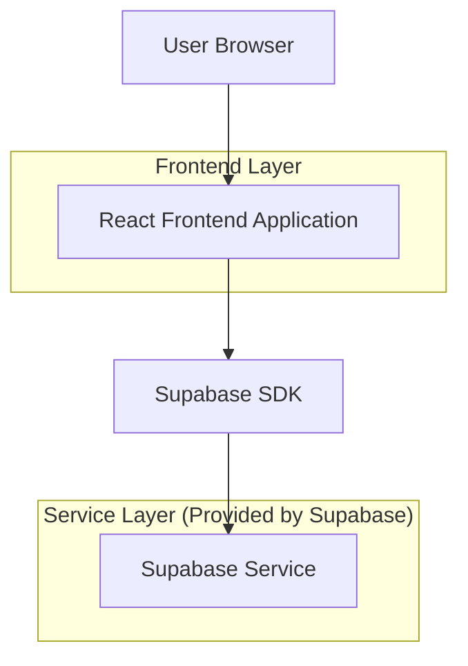
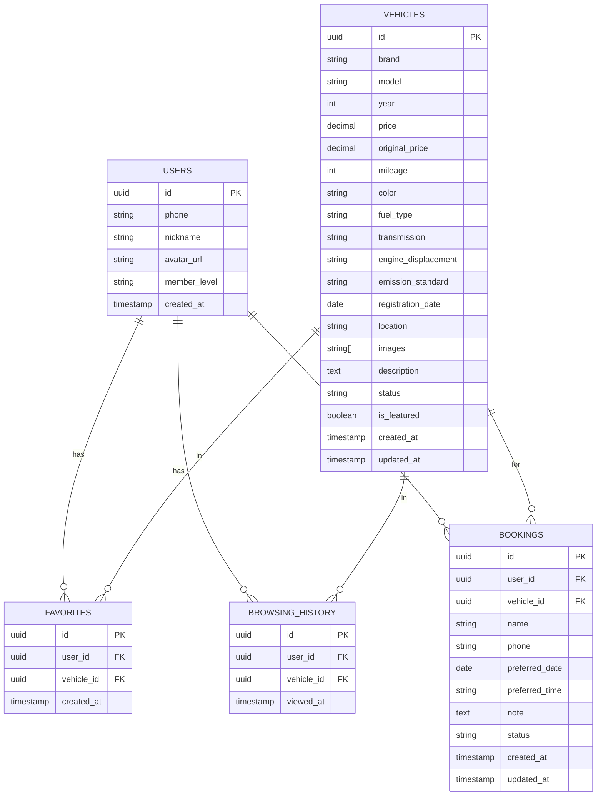

# 二手车智慧门店 - 技术架构文档 (Figma 设计风格版)

## 1. Architecture design



## 2. Technology Description

- **Frontend**: React@18 + TypeScript + TailwindCSS@3 + Vite
- **Initialization Tool**: vite-init
- **UI Components**: shadcn/ui + Radix UI primitives
- **Icons**: Lucide React
- **State Management**: React Query (TanStack Query) + Zustand
- **Backend**: Supabase (Authentication + PostgreSQL + Storage)
- **Image Storage**: Supabase Storage

## 3. Route definitions

| Route | Purpose |
|-------|---------|
| / | 首页，展示 Hero、分类入口、热门推荐、门店信息 |
| /vehicles | 车辆列表页，支持筛选和排序 |
| /vehicles/:id | 车辆详情页，展示车辆完整信息和预约功能 |
| /profile | 个人中心，用户信息和管理功能 |
| /profile/favorites | 收藏列表 |
| /profile/history | 浏览历史 |
| /profile/bookings | 预约记录 |
| /login | 登录页 |

## 4. API definitions

### 4.1 Supabase Database Schema

#### vehicles 表
```typescript
interface Vehicle {
  id: string;                    // UUID
  brand: string;                 // 品牌
  model: string;                 // 型号
  year: number;                  // 年份
  price: number;                 // 售价
  original_price: number;        // 新车指导价
  mileage: number;               // 里程数
  color: string;                 // 车身颜色
  fuel_type: string;             // 燃油类型
  transmission: string;          // 变速箱
  engine_displacement: string;   // 排量
  emission_standard: string;     // 排放标准
  registration_date: string;     // 上牌日期
  location: string;              // 所在城市
  images: string[];              // 图片数组
  description: string;           // 车辆描述
  status: 'available' | 'sold' | 'reserved';  // 状态
  is_featured: boolean;          // 是否推荐
  created_at: string;
  updated_at: string;
}
```

#### users 表 (使用 Supabase Auth)
```typescript
interface UserProfile {
  id: string;                    // UUID, 关联 auth.users
  phone: string;                 // 手机号
  nickname: string;              // 昵称
  avatar_url: string;            // 头像
  member_level: 'normal' | 'vip' | 'svip';
  created_at: string;
}
```

#### favorites 表
```typescript
interface Favorite {
  id: string;
  user_id: string;
  vehicle_id: string;
  created_at: string;
}
```

#### browsing_history 表
```typescript
interface BrowsingHistory {
  id: string;
  user_id: string;
  vehicle_id: string;
  viewed_at: string;
}
```

#### bookings 表
```typescript
interface Booking {
  id: string;
  user_id: string;
  vehicle_id: string;
  name: string;                  // 预约人姓名
  phone: string;                 // 联系电话
  preferred_date: string;        // 期望看车日期
  preferred_time: string;        // 期望时间段
  note: string;                  // 备注
  status: 'pending' | 'confirmed' | 'completed' | 'cancelled';
  created_at: string;
  updated_at: string;
}
```

### 4.2 Supabase RLS Policies

```sql
-- vehicles 表策略
GRANT SELECT ON vehicles TO anon;
GRANT SELECT ON vehicles TO authenticated;

-- user_profiles 表策略
CREATE POLICY "Users can view own profile"
  ON user_profiles FOR SELECT
  USING (auth.uid() = id);

CREATE POLICY "Users can update own profile"
  ON user_profiles FOR UPDATE
  USING (auth.uid() = id);

-- favorites 表策略
CREATE POLICY "Users can view own favorites"
  ON favorites FOR SELECT
  USING (auth.uid() = user_id);

CREATE POLICY "Users can insert own favorites"
  ON favorites FOR INSERT
  WITH CHECK (auth.uid() = user_id);

CREATE POLICY "Users can delete own favorites"
  ON favorites FOR DELETE
  USING (auth.uid() = user_id);

-- browsing_history 表策略
CREATE POLICY "Users can view own history"
  ON browsing_history FOR SELECT
  USING (auth.uid() = user_id);

CREATE POLICY "Users can insert own history"
  ON browsing_history FOR INSERT
  WITH CHECK (auth.uid() = user_id);

-- bookings 表策略
CREATE POLICY "Users can view own bookings"
  ON bookings FOR SELECT
  USING (auth.uid() = user_id);

CREATE POLICY "Users can create bookings"
  ON bookings FOR INSERT
  WITH CHECK (auth.uid() = user_id);
```

## 5. Data model

### 5.1 Data model definition



### 5.2 Data Definition Language

```sql
-- 创建车辆表
CREATE TABLE vehicles (
    id UUID PRIMARY KEY DEFAULT gen_random_uuid(),
    brand VARCHAR(100) NOT NULL,
    model VARCHAR(100) NOT NULL,
    year INTEGER NOT NULL,
    price DECIMAL(12, 2) NOT NULL,
    original_price DECIMAL(12, 2),
    mileage INTEGER NOT NULL,
    color VARCHAR(50),
    fuel_type VARCHAR(50),
    transmission VARCHAR(50),
    engine_displacement VARCHAR(20),
    emission_standard VARCHAR(50),
    registration_date DATE,
    location VARCHAR(100),
    images TEXT[] DEFAULT '{}',
    description TEXT,
    status VARCHAR(20) DEFAULT 'available' CHECK (status IN ('available', 'sold', 'reserved')),
    is_featured BOOLEAN DEFAULT false,
    created_at TIMESTAMP WITH TIME ZONE DEFAULT NOW(),
    updated_at TIMESTAMP WITH TIME ZONE DEFAULT NOW()
);

-- 创建用户资料表
CREATE TABLE user_profiles (
    id UUID PRIMARY KEY REFERENCES auth.users(id) ON DELETE CASCADE,
    phone VARCHAR(20),
    nickname VARCHAR(100),
    avatar_url TEXT,
    member_level VARCHAR(20) DEFAULT 'normal' CHECK (member_level IN ('normal', 'vip', 'svip')),
    created_at TIMESTAMP WITH TIME ZONE DEFAULT NOW()
);

-- 创建收藏表
CREATE TABLE favorites (
    id UUID PRIMARY KEY DEFAULT gen_random_uuid(),
    user_id UUID NOT NULL REFERENCES auth.users(id) ON DELETE CASCADE,
    vehicle_id UUID NOT NULL REFERENCES vehicles(id) ON DELETE CASCADE,
    created_at TIMESTAMP WITH TIME ZONE DEFAULT NOW(),
    UNIQUE(user_id, vehicle_id)
);

-- 创建浏览历史表
CREATE TABLE browsing_history (
    id UUID PRIMARY KEY DEFAULT gen_random_uuid(),
    user_id UUID NOT NULL REFERENCES auth.users(id) ON DELETE CASCADE,
    vehicle_id UUID NOT NULL REFERENCES vehicles(id) ON DELETE CASCADE,
    viewed_at TIMESTAMP WITH TIME ZONE DEFAULT NOW()
);

-- 创建预约表
CREATE TABLE bookings (
    id UUID PRIMARY KEY DEFAULT gen_random_uuid(),
    user_id UUID NOT NULL REFERENCES auth.users(id) ON DELETE CASCADE,
    vehicle_id UUID NOT NULL REFERENCES vehicles(id) ON DELETE CASCADE,
    name VARCHAR(100) NOT NULL,
    phone VARCHAR(20) NOT NULL,
    preferred_date DATE NOT NULL,
    preferred_time VARCHAR(50),
    note TEXT,
    status VARCHAR(20) DEFAULT 'pending' CHECK (status IN ('pending', 'confirmed', 'completed', 'cancelled')),
    created_at TIMESTAMP WITH TIME ZONE DEFAULT NOW(),
    updated_at TIMESTAMP WITH TIME ZONE DEFAULT NOW()
);

-- 创建索引
CREATE INDEX idx_vehicles_brand ON vehicles(brand);
CREATE INDEX idx_vehicles_price ON vehicles(price);
CREATE INDEX idx_vehicles_status ON vehicles(status);
CREATE INDEX idx_vehicles_is_featured ON vehicles(is_featured) WHERE is_featured = true;
CREATE INDEX idx_favorites_user_id ON favorites(user_id);
CREATE INDEX idx_browsing_history_user_id ON browsing_history(user_id);
CREATE INDEX idx_bookings_user_id ON bookings(user_id);

-- 插入示例车辆数据
INSERT INTO vehicles (brand, model, year, price, original_price, mileage, color, fuel_type, transmission, engine_displacement, emission_standard, registration_date, location, images, description, is_featured) VALUES
('奥迪', 'A4L', 2020, 185000, 320000, 35000, '白色', '汽油', '双离合', '2.0T', '国六', '2020-06-15', '北京', ARRAY['https://example.com/a4l-1.jpg'], '精品车况，无事故，全程4S店保养', true),
('宝马', '3系', 2019, 168000, 350000, 42000, '黑色', '汽油', '手自一体', '2.0T', '国六', '2019-08-20', '上海', ARRAY['https://example.com/bmw3-1.jpg'], '个人一手车，车况极佳', true),
('奔驰', 'C级', 2021, 228000, 380000, 18000, '银色', '汽油', '手自一体', '1.5T', '国六', '2021-03-10', '广州', ARRAY['https://example.com/cclass-1.jpg'], '准新车，配置丰富', true),
('丰田', '凯美瑞', 2018, 98000, 220000, 65000, '珍珠白', '汽油', '手自一体', '2.5L', '国五', '2018-11-05', '深圳', ARRAY['https://example.com/camry-1.jpg'], '日系保值神车，省油耐用', false),
('本田', '雅阁', 2019, 105000, 210000, 48000, '星空蓝', '汽油', '无级变速', '1.5T', '国六', '2019-05-18', '杭州', ARRAY['https://example.com/accord-1.jpg'], '空间大，油耗低，家用首选', false);
```

## 6. Component Structure

```
src/
├── components/
│   ├── ui/                    # shadcn/ui 基础组件
│   │   ├── button.tsx
│   │   ├── card.tsx
│   │   ├── input.tsx
│   │   ├── select.tsx
│   │   └── ...
│   ├── layout/                # 布局组件
│   │   ├── Header.tsx
│   │   ├── Footer.tsx
│   │   └── MainLayout.tsx
│   ├── vehicle/               # 车辆相关组件
│   │   ├── VehicleCard.tsx
│   │   ├── VehicleGrid.tsx
│   │   ├── VehicleFilter.tsx
│   │   ├── VehicleGallery.tsx
│   │   └── VehicleSpecs.tsx
│   └── home/                  # 首页组件
│       ├── HeroSection.tsx
│       ├── CategoryGrid.tsx
│       ├── FeaturedVehicles.tsx
│       └── StoreInfo.tsx
├── pages/
│   ├── Home.tsx
│   ├── VehicleList.tsx
│   ├── VehicleDetail.tsx
│   ├── Profile.tsx
│   └── Login.tsx
├── hooks/
│   ├── useVehicles.ts
│   ├── useFavorites.ts
│   └── useBookings.ts
├── lib/
│   ├── supabase.ts
│   └── utils.ts
└── types/
    └── index.ts
```

## 7. Key Implementation Notes

### 7.1 Figma 设计还原要点

- 使用 Tailwind 的 `gray` 色板匹配 Figma 灰度系统
- 卡片阴影使用 `shadow-lg` 或自定义 `box-shadow`
- 圆角统一使用 `rounded-xl` (12px) 或 `rounded-2xl` (16px)
- 间距系统遵循 4px 基准 (4, 8, 12, 16, 24, 32, 48, 64)
- 字体使用 Inter，通过 Google Fonts 引入

### 7.2 图片处理

- 使用 Supabase Storage 存储车辆图片
- 实现图片懒加载和渐进式加载
- 使用 WebP 格式优化加载速度
- 响应式图片使用 `srcset`

### 7.3 性能优化

- 使用 React Query 进行数据缓存
- 路由懒加载分割代码
- 图片优化和 CDN 加速
- 骨架屏提升感知性能
