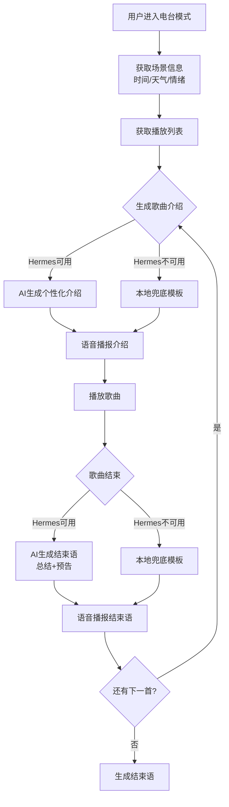

## 1. Product Overview

Hermudio 电台模式文案智能生成系统 - 通过 AI 动态生成歌曲介绍和结束语，模拟真人电台 DJ 效果，提升用户收听体验。

- 解决当前文案重复、生硬的问题，让每次播放都有新鲜感
- 根据歌曲信息、歌词内容、时间、天气、情绪等多维度变量生成个性化文案
- 目标用户：使用 Hermudio 电台模式收听音乐的用户

## 2. Core Features

### 2.1 User Roles

| Role | Registration Method | Core Permissions |
|------|---------------------|------------------|
| 普通用户 | 无需注册 | 收听电台、查看文案 |
| 登录用户 | 网易云音乐账号登录 | 完整收听、收藏歌曲、个性化推荐 |

### 2.2 Feature Module

电台文案智能生成系统包含以下核心功能模块：

1. **歌曲介绍生成**：根据歌曲、歌手、歌词、场景信息生成个性化开场白
2. **歌曲结束语生成**：根据播放历史、用户反馈、歌曲风格生成自然过渡语
3. **兜底文案策略**：当 AI 服务不可用时，使用本地多样化模板
4. **场景感知**：结合时间、天气、情绪等上下文信息生成文案
5. **文案缓存管理**：避免短时间内重复生成相同文案

### 2.3 Page Details

| Page Name | Module Name | Feature description |
|-----------|-------------|---------------------|
| 电台播放页 | 歌曲介绍生成 | 在播放前根据歌曲信息、歌词摘要、当前场景（时间/天气/情绪）调用 Hermes AI 生成个性化歌曲介绍文案 |
| 电台播放页 | 歌曲结束语生成 | 在歌曲结束后根据上一首歌曲信息、播放时长、用户反馈生成自然过渡语，并介绍下首歌 |
| 电台播放页 | 兜底文案模板 | 当 Hermes AI 不可用时，从本地多样化模板库中随机选择文案，确保服务可用性 |
| 电台播放页 | 场景信息展示 | 显示当前时间、天气、场景氛围等上下文信息，作为文案生成的参考 |
| 电台播放页 | 文案语音播报 | 将生成的文案通过 TTS 语音播报，配合文字高亮显示 |

## 3. Core Process

用户收听电台时的文案生成流程：

1. 用户进入电台模式，系统获取当前场景信息（时间、天气等）
2. 系统获取播放列表，准备播放第一首歌
3. 调用 Hermes AI 生成歌曲介绍文案，包含歌曲信息、歌词亮点、场景契合度
4. 语音播报歌曲介绍，然后开始播放歌曲
5. 歌曲播放结束后，调用 Hermes AI 生成结束语，总结刚才的歌曲并预告下一首
6. 如果 Hermes AI 不可用，使用本地兜底模板库随机选择文案
7. 循环播放下一首，重复步骤 3-6

## 4. User Interface Design

### 4.1 Design Style

- **主色调**：深色主题，背景色 #0a0a0f，卡片色 #12121a
- **强调色**：绿色渐变 #4ade80 到 #22d3ee
- **文字颜色**：主文字白色 #ffffff，次要文字 #a0a0b0
- **字体**：系统默认无衬线字体，标题 18px，正文 14px
- **布局**：卡片式布局，圆角 20px，内边距 16-20px
- **动画**：文字逐词高亮、进度条平滑过渡、脉冲呼吸效果

### 4.2 Page Design Overview

| Page Name | Module Name | UI Elements |
|-----------|-------------|-------------|
| 电台播放页 | 歌曲信息卡片 | 深色卡片背景，显示歌曲名（18px 白色粗体）和歌手名（13px 灰色），底部迷你播放器带进度条 |
| 电台播放页 | 文案展示区域 | 滚动区域显示 Hermes 生成的文案，当前播报的文字高亮显示（绿色 #4ade80），已播报文字透明度降低 |
| 电台播放页 | Hermes 语音控制条 | 底部固定控制条，显示 🎙️ 图标、播放时间、40段波形进度条、播放/暂停按钮 |
| 电台播放页 | 场景信息展示 | 顶部显示当前时间、天气图标、场景氛围标签（如"深夜"、"雨天"） |

### 4.3 Responsiveness

- **优先桌面端**：主要面向桌面浏览器用户
- **移动端适配**：支持移动端访问，布局自适应
- **触摸交互**：支持触摸滑动、点击操作

### 4.4 文案生成策略

**歌曲介绍文案要素**：
- 歌曲名称和艺术家的自然引入
- 歌词亮点或歌曲情感描述
- 与当前场景（时间/天气/情绪）的关联
- 邀请用户欣赏的引导语

**歌曲结束语文案要素**：
- 对刚播放歌曲的简单感受或评价
- 根据歌曲风格、情绪进行个性化回应
- 自然过渡到下首歌的预告
- 保持轻松、温暖的语气

**兜底文案模板分类**：
- 按时间段分类：凌晨、早晨、上午、中午、下午、傍晚、夜晚
- 按天气分类：晴天、雨天、阴天、雪天
- 按情绪分类：轻松、抒情、动感、怀旧、治愈
- 按风格分类：流行、摇滚、爵士、古典、民谣、电子
