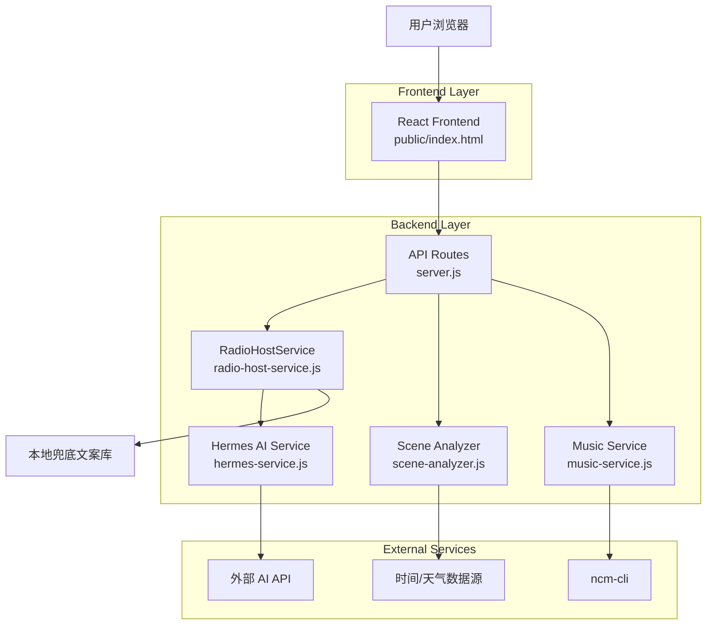
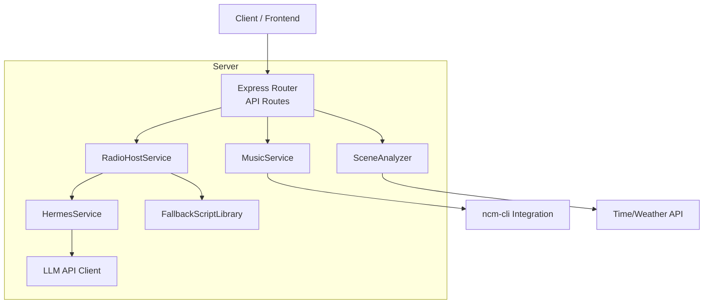
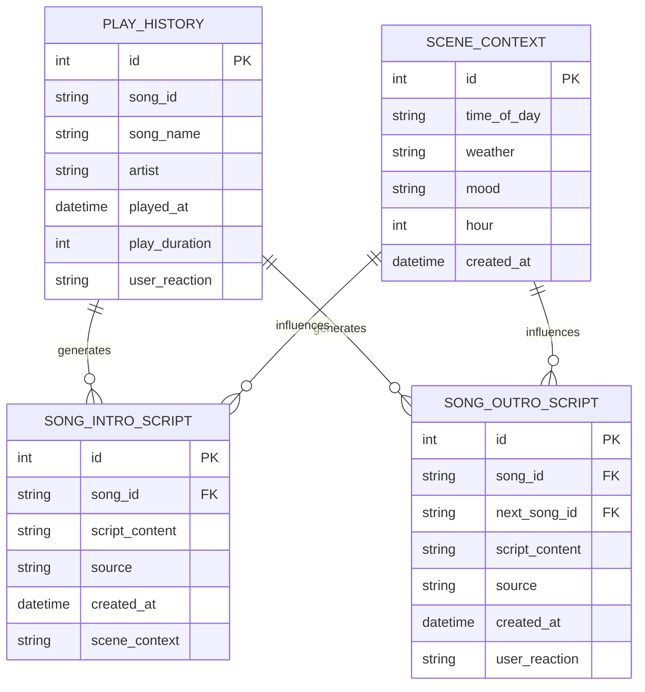

## 1. Architecture design



## 2. Technology Description

- **Frontend**: Vanilla JavaScript + HTML5 + CSS3
- **Backend**: Node.js + Express
- **Database**: SQLite3 (用户偏好、播放历史)
- **AI Service**: Hermes Service (集成外部 LLM API)
- **Music Source**: ncm-cli (网易云音乐 CLI)
- **TTS**: MiniMax TTS API
- **Initialization Tool**: npm init

## 3. Route definitions

| Route | Purpose |
|-------|---------|
| GET /api/radio/welcome | 生成电台欢迎语 |
| POST /api/radio/song-intro | 生成歌曲介绍文案 |
| POST /api/radio/song-outro | 生成歌曲结束语文案 |
| POST /api/radio/playlist-intro | 生成歌单整体介绍 |
| GET /api/radio/playlist | 获取今日播放列表 |
| GET /api/scene | 获取当前场景信息（时间/天气） |
| POST /api/tts/doubao | MiniMax TTS 语音合成 |

## 4. API definitions

### 4.1 Song Intro Generation

```
POST /api/radio/song-intro
```

Request:
| Param Name | Param Type | isRequired | Description |
|------------|------------|------------|-------------|
| song | object | true | 歌曲信息 {id, name, artist, album, lyrics?} |
| song.name | string | true | 歌曲名称 |
| song.artist | string | true | 歌手名称 |
| song.lyrics | string | false | 歌词内容（用于提取亮点） |

Response:
| Param Name | Param Type | Description |
|------------|------------|-------------|
| success | boolean | 请求是否成功 |
| script | string | 生成的歌曲介绍文案 |
| source | string | 文案来源：'ai' 或 'fallback' |

### 4.2 Song Outro Generation

```
POST /api/radio/song-outro
```

Request:
| Param Name | Param Type | isRequired | Description |
|------------|------------|------------|-------------|
| song | object | true | 刚播放完成的歌曲信息 |
| nextSong | object | false | 下一首歌曲信息（用于预告） |
| userReaction | string | false | 用户反馈（like/dislike/skip） |
| playDuration | number | false | 实际播放时长（秒） |

Response:
| Param Name | Param Type | Description |
|------------|------------|-------------|
| success | boolean | 请求是否成功 |
| script | string | 生成的结束语文案 |
| source | string | 文案来源：'ai' 或 'fallback' |

## 5. Server architecture diagram



## 6. Data model

### 6.1 Data model definition



### 6.2 Fallback Script Templates

本地兜底文案库结构（存储在 radio-host-service.js 中）：

```javascript
// 按时间段分类的歌曲介绍模板
const INTRO_TEMPLATES = {
  dawn: [  // 凌晨 0-6点
    "在这个安静的凌晨，让{artist}的《{name}》陪你度过这段独处的时光。",
    "凌晨的静谧中，{artist}用《{name}》诉说着{timeOfDay}的故事。",
    // ... 更多模板
  ],
  morning: [  // 早晨 6-12点
    "早安！{artist}的《{name}》是开启新一天的完美选择。",
    "晨光中，让{artist}的《{name}》为你注入今天的活力。",
    // ... 更多模板
  ],
  // ... afternoon, evening, night
};

// 按天气分类的结束语模板
const OUTRO_TEMPLATES = {
  sunny: [
    "刚才那首歌像今天的阳光一样温暖，接下来还有更多好音乐。",
    "{artist}的《{name}》和这好天气很配，让我们继续。",
    // ... 更多模板
  ],
  rainy: [
    "雨声配上{artist}的《{name}》，这样的组合让人沉醉。",
    "雨天听这样的歌，心情也变得柔软起来。",
    // ... 更多模板
  ],
  // ... cloudy, snowy
};

// 按情绪/风格分类的模板
const MOOD_TEMPLATES = {
  relaxed: [/* ... */],
  energetic: [/* ... */],
  melancholy: [/* ... */],
  romantic: [/* ... */],
};
```

### 6.3 AI Prompt Templates

Hermes AI 生成文案的 Prompt 模板：

**歌曲介绍 Prompt**：
```
你是Hermudio的电台主持人Hermes。

当前场景：{sceneDescription}
即将播放：{artist}的《{name}》
歌词亮点：{lyricsHighlight}
歌曲风格：{style}

请用中文生成一段15-20秒的歌曲介绍，要求：
1. 自然地引入歌曲和歌手
2. 结合当前场景（时间/天气）说明为什么现在播放这首歌很合适
3. 引用或暗示歌词中的情感或主题
4. 用温暖、亲切的语气邀请听众欣赏
5. 避免机械罗列信息，像真实的电台DJ一样自然

直接输出文案内容，不需要标注角色或格式。
```

**歌曲结束语 Prompt**：
```
你是Hermudio的电台主持人Hermes。

刚播放完：{artist}的《{name}》
歌曲风格：{style}
播放时长：{playDuration}秒
用户反馈：{userReaction}

下一首预告：{nextArtist}的《{nextName}》

请用中文生成一段10-15秒的结束语，要求：
1. 对刚才这首歌给出个性化感受（不要千篇一律）
2. 如果用户喜欢这首歌，可以预告下一首风格相似
3. 自然地过渡到下一首歌
4. 保持轻松、温暖的语气
5. 每次回复都要有所不同，避免重复

直接输出文案内容。
```
